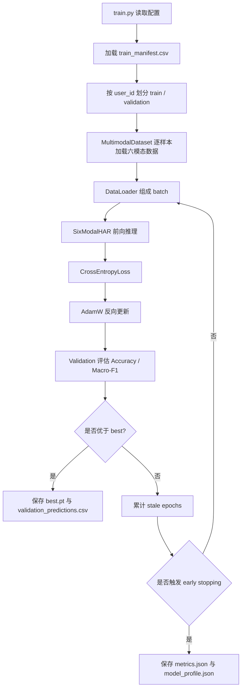

# 当前训练方案技术架构说明

本文用于向老师说明当前 `train.py` 对应的多模态 HAR 训练方案、模型结构、数据流转方式，以及为什么采用这条技术路线。内容尽量贴近现有代码实现，方便直接对照仓库中的训练逻辑理解。

## 1. 项目目标

本项目面向 CUHK-X Small Model Track 的人体动作识别任务，核心目标有三点。

1. 在 40 类动作分类任务上建立一个可复现、可解释的基线模型。
2. 充分利用多模态信息，提升跨受试者场景下的泛化能力。
3. 保持模型足够轻量，便于后续提交、迭代和压缩。

当前方案不是把所有模态简单拼接，而是采用“模态专属编码 + 轻量门控融合”的思路。这样做的直接原因是：不同模态的时间结构、噪声类型、缺失情况都不同，统一用同一种网络处理通常不划算，也不利于解释。

---

## 2. 当前方案的一句话概括

当前模型可以概括为：

```text
Depth_Color / IR / Thermal
    -> 共享轻量 2D CNN
    -> 每帧特征
    -> 时间平均

Skeleton
    -> 中心化坐标 + 速度
    -> 1D TCN

IMU
    -> 两份 CSV 数值序列
    -> 1D TCN

Radar
    -> 每帧点云统计特征
    -> 1D TCN

6 个 embedding
    -> modality mask
    -> 门控权重 softmax
    -> 加权融合
    -> 40 类分类
```

也就是说，模型不是先把原始数据直接拼成一个大张量，而是先为每个模态提取结构化 embedding，再根据该样本实际可用模态做加权融合。

---

## 3. 代码结构与职责分工

当前训练链路主要由以下文件组成。

- [train.py](../train.py)：训练主入口，负责配置读取、数据划分、训练循环、验证、早停和模型保存。
- [src/data.py](../src/data.py)：多模态数据集实现，负责从 manifest 读取样本并整理成统一 batch。
- [src/model.py](../src/model.py)：六模态网络结构，定义视觉编码器、时序编码器、门控融合和分类头。
- [configs/demo.yaml](../configs/demo.yaml)：默认训练配置，控制输入尺寸、序列长度、batch size、学习率等超参数。
- [README.md](../README.md)：说明当前 baseline 的使用方式和阶段性路线。

从职责上看，`train.py` 不直接关心每种模态怎么提特征，它只负责把 batch 送进模型、算损失、做验证和保存最佳权重。真正决定“每种模态怎么被编码”的逻辑在 `src/model.py` 和 `src/data.py` 中。

---

## 4. 数据流与训练流总览

整个流程可以按下面的顺序理解。



这条链路的关键点在于：训练和验证是按受试者划分的，不是随机切 clip。这样能更真实地模拟测试场景，因为测试集中的用户与训练集用户不同。

---

## 5. 数据集与样本组织方式

### 5.1 manifest 驱动而不是临时遍历目录

`train.py` 不是直接在数据目录里现查现读，而是先从 `artifacts/manifests/train_manifest.csv` 读入样本清单。这样做有两个好处：

1. 训练时不需要反复扫描海量文件。
2. 样本级元信息已经标准化，后续可以直接做分组、审计和复现实验。

### 5.2 受试者划分

训练主流程会调用 `split_by_users(manifest, validation_users)`，将指定用户划入验证集，其余进入训练集。代码里还显式检查训练/验证是否有用户重叠，如果有就直接报错，避免 subject leakage。

这一步很重要。因为 HAR 问题里，如果同一个人的数据同时出现在训练和验证中，模型很容易学习到个体特征而不是动作本身，验证分数会虚高。

### 5.3 单样本返回结构

在 `src/data.py` 里，`MultimodalDataset.__getitem__` 会返回一个统一字典，核心字段包括：

- `images`：三个视觉模态的数据，形状为 `[3, frames, 3, H, W]`
- `skeleton`：骨架时序序列
- `imu`：IMU 序列
- `radar`：Radar 时序序列
- `modality_mask`：模态可用性掩码
- `clip_id`：样本编号
- `label`：训练标签

这个统一返回结构是后续融合策略成立的基础。它让不同模态在训练循环里看起来是同一种 batch 结构，但实际每种模态内部仍然保留自己的编码方式。

---

## 6. 各模态的特征设计思路

当前方案的核心不是“多模态都堆大网络”，而是对每种模态做符合其数据形态的压缩表达。

### 6.1 Depth_Color / IR / Thermal：共享轻量 2D CNN

这三种模态都属于图像序列，当前方案对它们使用同一个轻量 CNN 编码器，逻辑是：

1. 每帧独立送入 2D CNN。
2. 提取每帧的空间特征。
3. 对时间维做平均池化，得到该模态的 clip-level embedding。

`src/model.py` 中的 `VisualEncoder` 实现了这个流程。它的结构是几层轻量卷积块加全局池化，再接线性投影层。对三个图像模态复用同一套 backbone，有两个明显好处：

- 参数量较小，符合轻量化目标。
- 三个视觉模态的编码空间更容易对齐，便于后续门控融合。

这里并没有使用复杂的 3D CNN 或时序 Transformer，原因是当前阶段更重视“先跑通、再验证增益”。对于 cross-subject 任务，很多时候中等规模的轻量 CNN + 稳定融合就能得到更稳的收益。

### 6.2 Skeleton：中心化坐标 + 速度 -> 1D TCN

骨架数据天然是时间序列，但它不是图像。当前方案把每一帧的关节点坐标展开后，拼接出速度信息，再送入 1D 时序卷积。

具体处理思路是：

1. 读取每帧 JSON 中的 17 个关键点。
2. 对关节点坐标做中心化，减弱个体位置偏移。
3. 做尺度归一化，降低不同人体和拍摄距离带来的影响。
4. 展开为向量序列后，再补充一阶差分作为速度特征。
5. 用 1D TCN 提取局部时序模式，最后池化得到 embedding。

`src/model.py` 中的 `TemporalEncoder` 就是这个思路在网络侧的统一实现，而 `src/data.py` 中 `_load_skeleton()` 负责把原始 JSON 变成可喂入模型的序列张量。

### 6.3 IMU：两份 CSV 数值序列 -> 1D TCN

IMU 数据本质上是低维传感器时序，适合用 1D 时序网络而不是图像网络。

当前做法是：

1. 从一个样本中读取前两份 CSV。
2. 对每份 CSV 提取数值列。
3. 做通道归一化和定长重采样。
4. 把两份序列拼接后送入同一个 1D TCN。

这样做的思路是把 IMU 看成一组连续的动作惯性信号，而不是离散表格数据。TCN 能够在局部窗口内建模运动节奏、加速度变化和姿态变化，对动作识别比较合适。

### 6.4 Radar：每帧点云统计特征 -> 1D TCN

Radar 数据原始形态往往较稀疏、噪声更大，直接上重模型不一定划算。当前方案先做统计压缩，再做时序编码。

具体处理方式是：

1. 按 `frame` 分组。
2. 对每帧提取 `x, y, z, v, snr` 的均值、标准差、最大值和点数等统计量。
3. 将这些统计量拼接成每帧特征。
4. 经过归一化和重采样后，输入 1D TCN。

这条路线的优点是工程上很稳，不依赖复杂的点云网络，也能保留 Radar 对运动趋势、速度和稀疏空间分布的描述能力。

---

## 7. 融合层设计：从“看得见的模态”到“可学习的权重”

### 7.1 六个 embedding 的形成

经过编码后，模型会得到 6 个模态级 embedding：

- `Depth_Color` embedding
- `IR` embedding
- `Thermal` embedding
- `Skeleton` embedding
- `IMU` embedding
- `Radar` embedding

在实现上，三个图像模态都来自共享视觉编码器，但它们各自保留不同的模态标识，因此仍然是三个独立 embedding。

### 7.2 modality mask 的作用

不同样本不一定有完整的六模态输入，所以模型不能默认每个模态都存在。`modality_mask` 就是为了解决这个问题。

它的作用有两个：

1. 标记当前样本哪些模态有效。
2. 在门控打分时把无效模态强行压低，避免它们参与 softmax。

这比简单地用全零向量拼接更稳，因为模型不会把“缺失模态”误当成一种真实信号。

### 7.3 门控权重 softmax

每个 embedding 会先经过一个小型 gate 网络，输出一个标量 score。随后对所有有效模态做 softmax，得到权重分布。

直观上，这表示模型会根据当前样本的内容和模态质量，自动决定哪个模态更可信。

门控设计的价值在于：

- 不同模态贡献不固定。
- 某些样本中视觉信息更强，某些样本中骨架或惯性信息更强。
- 缺失模态时，权重机制可以自然退化。

### 7.4 加权融合

门控权重得到后，模型对 6 个 embedding 做加权求和，形成最终融合向量：

```text
fused = Σ (weight_i × embedding_i)
```

这个融合方式比简单拼接更轻量，也更容易在当前模型体量约束下保持稳定训练。它的另一个优点是可解释性较强：训练结束后可以直接查看不同模态在样本上的权重分布，分析模型更依赖哪一类信息。

---

## 8. 分类头与输出

融合后的向量会进入一个轻量分类器：

1. `LayerNorm`
2. `Dropout`
3. 线性层映射到 40 类

训练时使用的是标准交叉熵损失，输出的是 40 类 logits。验证阶段会取 `argmax` 作为预测类别，并计算 Accuracy 和 Macro-F1。

---

## 9. 训练循环的实现逻辑

### 9.1 训练初始化

`train.py` 的入口逻辑如下：

1. 读取配置文件。
2. 固定随机种子。
3. 创建输出目录并保存配置副本。
4. 读取 manifest。
5. 按指定用户划分训练集和验证集。
6. 构造 `MultimodalDataset` 和 `DataLoader`。
7. 初始化模型、优化器、学习率调度器和 AMP。

### 9.2 训练阶段

每个 epoch 中，训练过程的顺序是：

1. `model.train()`。
2. 遍历训练 batch。
3. 将 batch 移动到 GPU 或 CPU。
4. 在 AMP 下前向传播。
5. 计算交叉熵损失。
6. 反向传播并更新参数。
7. 记录训练 loss。

当前优化器使用 `AdamW`，学习率调度器使用 `CosineAnnealingLR`。这是一种比较常见的轻量稳定组合，适合当前这种多模态但规模不算特别大的分类任务。

### 9.3 验证与早停

每个 epoch 结束后都会跑一次验证集：

1. `model.eval()`。
2. 不计算梯度。
3. 累积所有验证样本的标签和预测结果。
4. 计算 Accuracy 和 Macro-F1。
5. 若当前 Accuracy 优于历史最好结果，则保存 `best.pt`。
6. 若连续若干轮没有提升，则触发 early stopping。

这里的 early stopping 不是为了“少跑几轮”，而是为了防止后期在验证集上过拟合，同时节约实验时间。

---

## 10. 训练配置的含义

默认配置文件是 [configs/demo.yaml](../configs/demo.yaml)，核心参数如下。

- `image_size: 112`：视觉输入分辨率。
- `image_frames: 8`：每个视觉模态采样 8 帧。
- `sequence_length: 64`：Skeleton、IMU、Radar 统一重采样到 64 步。
- `embedding_dim: 128`：各模态 embedding 维度。
- `batch_size: 12`：训练 batch 大小。
- `learning_rate: 3e-4`：AdamW 学习率。
- `weight_decay: 1e-4`：权重衰减。
- `amp: true`：启用混合精度训练。
- `early_stopping_patience: 6`：验证集多轮无提升后停止。

这些配置体现的是一个非常明确的工程取向：先保证训练能稳定完成，再逐步尝试提升上限。当前阶段更看重可复现性和可解释性，而不是一上来就追求最复杂的结构。

---

## 11. 当前方案的技术路线价值

### 11.1 为什么采用“模态专属编码”

因为不同模态本身的数据类型完全不同：图像、骨架坐标、惯性数值、雷达统计特征不能用一套统一预处理强行兼容。模态专属编码能让每类信息都走最合适的特征提取器。

### 11.2 为什么不直接早期拼接原始特征

原始拼接虽然简单，但会把大量分布差异很大的数据硬凑在一起，训练更难稳定，也不利于分析每个模态的独立贡献。当前的 late fusion 或 gated fusion 更适合做消融和解释。

### 11.3 为什么加入 modality mask

因为测试样本可能缺模态。如果模型假设所有模态都完整，就会在真实推理时出问题。mask + softmax 门控可以让模型对缺失模态自然降权，鲁棒性更高。

### 11.4 为什么选轻量 2D CNN + 1D TCN

当前任务强调多模态和跨受试者泛化，而不是单纯扩大参数量。轻量 CNN 与 TCN 的组合有三个好处：

1. 参数少，便于控制模型体积。
2. 训练稳定，收敛过程可控。
3. 容易解释每个模态的贡献。

这正好符合当前项目先建立稳健 baseline 的目标。

---

## 12. 目前实现层面的关键点

### 12.1 `train.py` 做了什么

`train.py` 是控制层，不负责具体特征提取。它主要完成：

- 配置加载
- 用户级划分
- 数据加载器构造
- 模型训练
- 验证评估
- 最优模型保存
- 训练历史与模型体积统计

### 12.2 `src/data.py` 做了什么

它负责把原始文件组织成张量。重点包括：

- 图像帧抽样和 resize
- Skeleton 关键点中心化与速度构造
- IMU CSV 的数值清洗和重采样
- Radar 统计特征构造
- 模态可用性 mask 构造

### 12.3 `src/model.py` 做了什么

它负责把张量变成可分类的融合特征。重点包括：

- 共享视觉编码器
- 三路时序编码器
- 门控打分
- masked softmax 融合
- 40 类分类头

---

## 13. 可以给老师讲的“整体思路”版本

如果需要在汇报时用比较口语化的方式描述，可以这样讲：

> 我们当前的方案不是把六个模态简单拼接，而是先按数据类型分别建模。Depth_Color、IR 和 Thermal 属于图像序列，所以它们共享一个轻量 2D CNN，逐帧提特征后做时间平均；Skeleton、IMU 和 Radar 属于时序数值数据，所以走 1D TCN。每个模态最终输出一个 embedding，再通过 modality mask 和门控 softmax 动态决定每个模态的权重，最后做加权融合完成 40 类分类。训练时采用按受试者划分验证集，避免数据泄漏，验证指标主要看 Accuracy 和 Macro-F1，并保存最优 checkpoint。

---

## 14. 当前方案的优点与风险

### 优点

- 模态分工清晰，结构可解释。
- 训练流程简单稳定，容易复现。
- 支持缺失模态，贴近测试实际。
- 模型体积相对可控，便于后续压缩和提交。

### 风险

- 共享视觉 backbone 虽然省参数，但也可能限制不同图像模态的专属表达能力。
- 1D TCN 对序列长度和重采样质量比较敏感。
- 门控融合的效果依赖于训练集的模态完整性，如果缺失模式很复杂，可能需要更细的鲁棒训练策略。
- 当前方案仍属于轻量基线，后续如果要进一步提升上限，可能需要引入更强的时序建模或更细粒度的后融合策略。

---

## 15. 后续技术路线建议

当前方案适合作为第一版稳定 baseline。后续可以按下面顺序迭代：

1. 先做单模态对照实验，确认 Depth_Color、Skeleton、IMU、Radar 的单独收益。
2. 再做两两融合，验证哪些模态组合最互补。
3. 对视觉分支尝试更强的时序聚合方式，例如 attention pooling 或轻量 temporal module。
4. 对门控权重加入更强的缺失模态鲁棒训练。
5. 若性能瓶颈明显，再尝试蒸馏或更小的结构压缩。

这条路线的核心原则仍然是：先做可解释、可复现的基线，再逐层增加复杂度，而不是一开始把所有复杂技巧堆到一起。

---

## 16. 结论

当前训练方案的本质是一个“按模态分治、以门控融合”的轻量多模态分类系统。`train.py` 负责训练编排，`src/data.py` 负责把原始多源数据变成统一样本结构，`src/model.py` 则将六个模态分别编码成 embedding，再通过 mask-aware gating 完成融合，最终输出 40 类动作预测。

这条路线的优势在于结构清晰、易讲解、易排错、易扩展，也适合作为后续实验迭代的基础版本。
